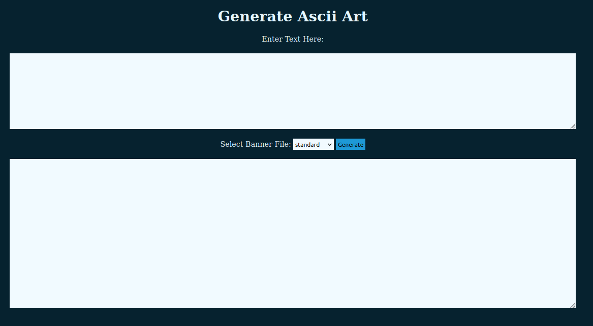
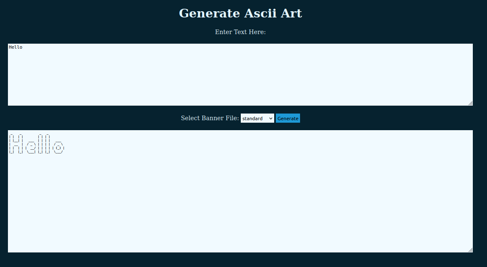
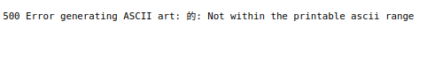
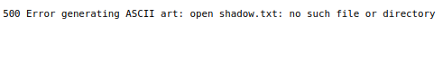
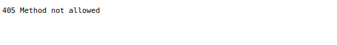

# ASCII-ART-WEB
## Description
The ASCII Art Web is a web application that allows a user to generate ASCII art based on different art styles and input text. Users can select an art style and provide text, and the application will generate and display ASCII art corresponding to the chosen style.
## Usage: How to run
To run the ASCII Art Web application, follow these steps:
1. Install dependancies:

    Ensure you have Go installed. If not, download and install it from [here](https://go.dev/doc/install).

2. Clone the repository:
    ```bash
    git clone https://learn.zone01kisumu.ke/git/johopiyo/ascii-art-web
    cd ascii-art-web
    ```
3. Run the server:
    ```bash
    go run .
    ```
4. Access the server:
    Open your web browser and navigate to http://localhost:8080 to start using the ASCII Art Web


## Implementation
The implementation of the ASCII Art Web is structured as follows:

* main.go: The main entry point for the web application.

* ascii-art/: Contains the core logic for generating ASCII art.

    1. ascii-art.go: Main logic for ASCII art generation.

    2. ascii/printascii.go: Functions for printing ASCII art.

    3. banner/readbanner.go: Functions for reading different banner styles.

    4. banner/readbanner_test.go: Tests for banner reading functions.

    5. banner/shadow.txt, standard.txt, thinkertoy.txt: Different banner styles.

    6. errs/errorchecks.go: Error handling for the ASCII art generation.

    7. errs/errorchecks_test.go: Tests for error handling functions.


* static/: Contains static files such as CSS.

    1. css/styling.css: Stylesheet for the web application.


* templates/: Contains HTML templates.

    1. index.html: Main HTML template for the application.

## Displays
### Home Page

When you first run the application, you will see the home page as shown below:




### Generating ASCII Art

After entering the text and selecting an art style, the generated ASCII art will be displayed as follows:



### Handling Non-Printable ASCII Characters

If you input non-printable ASCII characters, an error message will be displayed:



### Missing Banner File

If a banner file is missing, in our example the shadow.txt file has been deleted, an error message will be displayed indicating the issue:



### Manually Input the route
If we manually insert the route /ascii-art to our server link as a GET request, It shall display the below error message.



## Authors
This project has been authored by:
1. Quinter Ochieng 
2. Hillary Okello
3. John Opiyo
## License
This project is licensed under the [MIT](LICENSE) License
